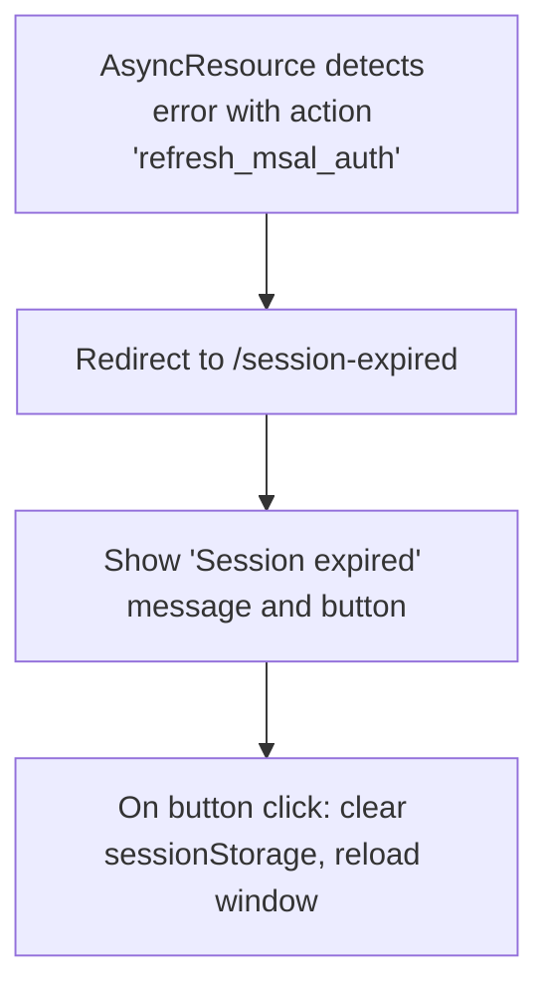

# Plan: Handling "refresh_msal_auth" Error in [`AsyncResource`](src/components/async-resource/async-resource.tsx)

## 1. Create a Minimal "Session Expired" Page

- New component: [`src/pages/session-expired.tsx`](src/pages/session-expired.tsx)
- Content:
  - Heading: "Session expired"
  - Button: "Re-authenticate"
    - On click: clear all `sessionStorage` keys, then reload the window.

## 2. Add Route for the New Page

- Update your main router (likely [`src/routes.ts`](src/routes.ts) or [`src/pages/page-root/index.tsx`](src/pages/page-root/index.tsx)) to include a route for `/session-expired` pointing to the new component.

## 3. Update AsyncResource Error Handling

- In [`AsyncResource`](src/components/async-resource/async-resource.tsx):
  - When `action === 'refresh_msal_auth'`, use React Router's `useNavigate` to redirect to `/session-expired` instead of reloading the window.

## 4. Implementation Details

- **SessionStorage Clearing:**
  Use `sessionStorage.clear()` or iterate and remove only MSAL-related keys if needed.
- **Minimal Design:**
  Use basic HTML elements and minimal styling.

## 5. Diagram

---

Does this plan match your expectations? If so, I will request to switch to code mode for implementation.
